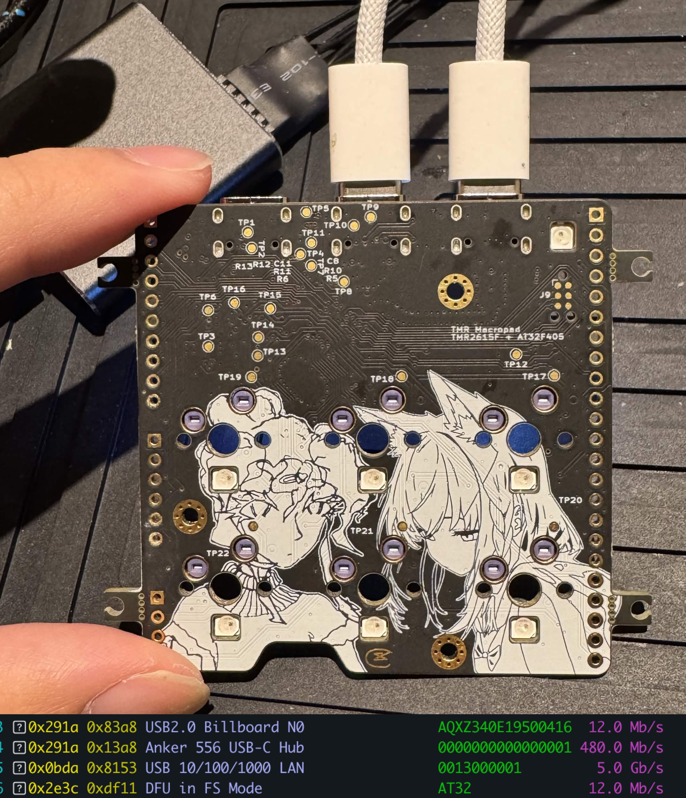

# Giris

An open-source 32 key/half (64 total) **analog TMR split ortholinear keyboard**. Layout is similar to Keeb.io Iris with an extra column. Uses TMR2615F, 4:8 TMUX1574RSVR Mux, & AT32F405. Link is UART over type-c cable.

There are 3 unique modes of operation: 
- standalone
- half A --> half B --> computer
- computer A <-- half A <--> half B --> computer B
    - Giris doubles as a KVM, you can control which computer you're typing on with a programmable macro
    - Relevant power circuitry to prevent backfeeding (GROUNDS ARE STILL BONDED!!!)

Done by Human:
- `hw/` — KiCad schematics and layout. `TMR2615F_osu_pad` is the 6-key development board the
  firmware is brought up on; `giris` is the full-size split.
- `mech/` — plates and frames.

Done by LLM + Human:
- `fw/` — firmware, written from scratch in C on the Artery BSP with TinyUSB. 8 kHz USB HS polling,
  8 kHz inter-half link. Host tools and a WebHID configurator live in `fw/tools/`.

## Schematics and photos



PDFs:

- **osu pad dev board** (built and running, pictured above):
  [schematic](hw/TMR2615F_osu_pad/output/TMR2615F_osu_pad.pdf) ·
  [PCB layers](hw/TMR2615F_osu_pad/output/TMR2615F_osu_pad-layers.pdf)
- **Giris split** (in layout): [schematic](hw/giris/output/giris.pdf)
- **More photos and video** of built boards: [`docs/photos/`](docs/photos/)

The schematic PDFs draw the per-key sheet once and list each key's designators at the end;
regenerate them with `hw/tools/sch_pdf.py`.

## Setup

This repo uses git submodules for its shared footprint/3D-model library (`hw/library`) and `hw/marbastlib`. **The 3D bodies will not appear in KiCad's 3D viewer unless the submodules are checked out**; `.step` files live in `hw/library/packages3d/`.

Clone with submodules:

```bash
git clone --recurse-submodules https://github.com/dubnubdubnub/Giris.git
```

If you already cloned without `--recurse-submodules`, initialize them after the fact:

```bash
git submodule update --init --recursive
```

> Note: `hw/marbastlib` may print an error while recursing into a nested `.history` submodule. That is harmless — it is upstream and holds no 3D models the boards need.

## 3D models

Footprint 3D bodies resolve from three locations:

- `${KICAD10_3DMODEL_DIR}/…` — the standard models shipped with KiCad.
- `${KIPRJMOD}/../library/packages3d/…` — this repo's `hw/library` submodule (must be checked out; see Setup).

When adding new 3D models to a board, reference them with one of the path variables above rather than a bare relative path (e.g. `../../packages3d/…`), so they resolve regardless of where the repo is cloned.

## Licence

Giris uses two licences:

| What | Licence | File |
|---|---|---|
| Firmware, host tools, web configurator, docs | **Apache-2.0** | [`LICENSE`](LICENSE) |
| Hardware — schematics, PCB, magnet models (`hw/`) | **CERN-OHL-P v2** | [`hw/LICENSE`](hw/LICENSE) |

Both are permissive: use it, change it, build it, sell it, no obligation to
publish your changes. Apache-2.0 additionally carries an explicit patent grant.
CERN-OHL-P is the hardware equivalent — software licences are written about
copying source, not about manufacturing a board.

New source files should carry an SPDX header:

```c
/* SPDX-License-Identifier: Apache-2.0
 * Copyright 2026 Isaac Chiu
 */
```

### Third-party code

[`THIRD_PARTY.md`](THIRD_PARTY.md) is the full inventory; [`NOTICE`](NOTICE)
carries the attributions that must accompany a distributed **binary**.

The short version: TinyUSB (MIT) and the ArteryTek BSP are fetched at build time
by `fw/tools/fetch-deps.sh` and are not in this repository, though both are linked
into firmware binaries. Three Artery-derived files *are* committed — the startup
file, the linker script and `at32f402_405_conf.h` — and keep Artery's notice
rather than Giris'. Note that Artery ships two licence statements that disagree;
`THIRD_PARTY.md` explains which one to rely on.

### Why the firmware is not GPL

Giris is written from scratch. libhmk, minipad, DeskHop and the VIA app are
GPL-3.0; QMK, vial-qmk and Keychron's fork are GPL-2.0. All were read as
references and **no source file was ever pasted out of any of them**. That is a
deliberate, ongoing constraint, not an accident — copying so much as a descriptor
struct would make this firmware copyleft.

This matters most for the USB XUSB (Xbox controller) interface, where both
reference implementations — libhmk and Keychron's QMK fork — are copyleft. Write
it from Microsoft's own specification instead:

> **[MS-XUSBI]** — *Xbox Universal Serial Bus Protocol (XUSB) Interface Extension*
> <https://learn.microsoft.com/en-us/openspecs/windows_protocols/ms-xusbi/c79474e7-3968-43d1-8d2f-175d47bef43e>

It gives the class triple and the 20-byte report normatively, and its Open
Specifications notice explicitly permits copying the documentation in order to
build implementations of it. [`THIRD_PARTY.md`](THIRD_PARTY.md) records the
limits of that permission — notably that no patent grant is established.
